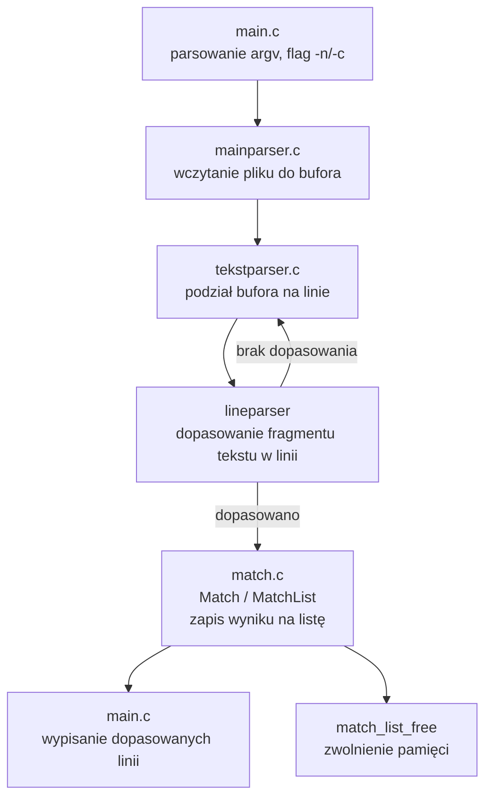

# meep

Proste narzędzie CLI w C do wyszukiwania fragmentu tekstu w pliku, linia po linii (coś w stylu uproszczonego `grep`).

## Build

```sh
gcc main.c mainparser.c tekstparser.c match.c -o meep
```

## Użycie

```sh
./meep <szukany_tekst> <plik>
```

Przykład:

```sh
./meep haha haha.txt
```

Program wypisze wszystkie linie z pliku zawierające podany fragment tekstu.

> Flagi `-n` (numery linii) i `-c` (liczba dopasowań) są rozpoznawane, ale ich logika nie jest jeszcze zaimplementowana — obecnie tylko wypisują komunikat i kończą działanie.

## Jak to działa



## Struktura plików

| Plik | Rola |
|---|---|
| `main.c` | punkt wejścia, parsowanie argumentów |
| `mainparser.c/h` | wczytanie pliku do pamięci, uruchomienie parsowania |
| `tekstparser.c/h` | podział tekstu na linie i wyszukiwanie dopasowań |
| `match.c/h` | struktura `Match`/`MatchList` przechowująca wyniki |
